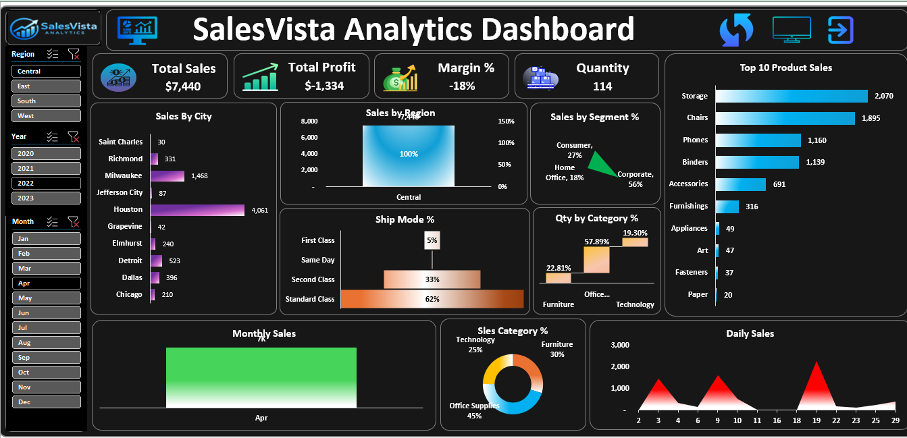

# 📊 SalesVista Analytics Dashboard

### Interactive Excel Dashboard for Sales Performance Monitoring, KPI Reporting, and Business Intelligence Analysis

---

## 🚀 Project Overview

SalesVista Analytics Dashboard is an advanced Excel-based Business Intelligence solution developed to analyze sales performance, profitability, customer segments, product categories, and regional trends. The dashboard transforms raw sales data into meaningful insights through interactive visualizations, KPI tracking, dynamic filtering, and VBA-powered automation to support data-driven decision-making.

---

## 🎯 Business Objective

The primary objective of this project is to transform raw sales data into actionable business insights through an interactive dashboard that enables stakeholders to:

* Monitor sales and profitability performance
* Identify top-performing products and regions
* Analyze customer and segment behavior
* Track sales trends over time
* Support strategic business decisions

---

## ⭐ Project Highlights

* Interactive Excel Dashboard with dynamic slicers
* KPI-based Sales Performance Monitoring
* VBA-powered Dashboard Automation
* Region-wise and City-wise Sales Analysis
* Customer Segment Performance Analysis
* Product Category Insights
* Business Intelligence Reporting
* Data-driven Decision Support

---

## 📈 Key Performance Indicators (KPIs)

* Total Sales
* Total Profit
* Profit Margin (%)
* Quantity Sold

---

## 🛠️ Tools & Technologies Used

* Microsoft Excel
* Pivot Tables
* Pivot Charts
* Slicers
* VBA Macros
* Conditional Formatting
* Data Visualization
* Business Intelligence Reporting

---

## ✨ Dashboard Features

### Interactive Filters

* Region Filter
* Year Filter
* Month Filter

### Visual Analytics

* Sales by Region
* Sales by City
* Sales by Customer Segment
* Quantity by Product Category
* Product Category Distribution
* Monthly Sales Trend
* Daily Sales Trend
* Ship Mode Analysis
* Top 10 Products by Sales

### Automation Features

* Dashboard Refresh Button (VBA)
* Dashboard Navigation Button
* Presentation Mode Dashboard

---

## 💡 Business Insights

This dashboard helps users:

* Monitor overall sales and profitability performance
* Compare sales performance across regions and cities
* Analyze customer segments and purchasing behavior
* Track monthly and daily sales trends
* Identify top-performing products
* Evaluate product category performance
* Analyze shipping mode distribution
* Support business growth through data-driven insights

---

## 🧠 Skills Demonstrated

* MIS Reporting
* Data Analysis
* Business Intelligence Reporting
* Dashboard Development
* Excel Automation
* Data Visualization
* KPI Reporting
* VBA Programming
* Interactive Reporting
* Analytical Thinking

---

## 📷 Dashboard Preview

## Interactive Features

---

## 📁 Project Structure

SalesVista-Analytics-Dashboard/

├── README.md

├── SalesVista Analytics Dashboard.xlsm

├── dashboard-preview.png

├── dashboard-interactive-features.png

└── Insights_Reports.pdf

---

## ▶️ How to Use

1. Download the Excel dashboard file.
2. Open the workbook in Microsoft Excel.
3. Enable Macros if prompted.
4. Use slicers to filter dashboard data dynamically.
5. Click the Refresh button to update dashboard visuals.
6. Explore KPIs and charts for business insights.

---

## 👩‍💻 Author

**Shradha Singh**

MIS Executive | MCA Graduate | Excel Dashboard Developer | Aspiring Data Analyst

---

## 🔗 Connect With Me

**LinkedIn:** https://www.linkedin.com/in/shradha-singh-42416222a

**GitHub:** https://github.com/Shradha-08