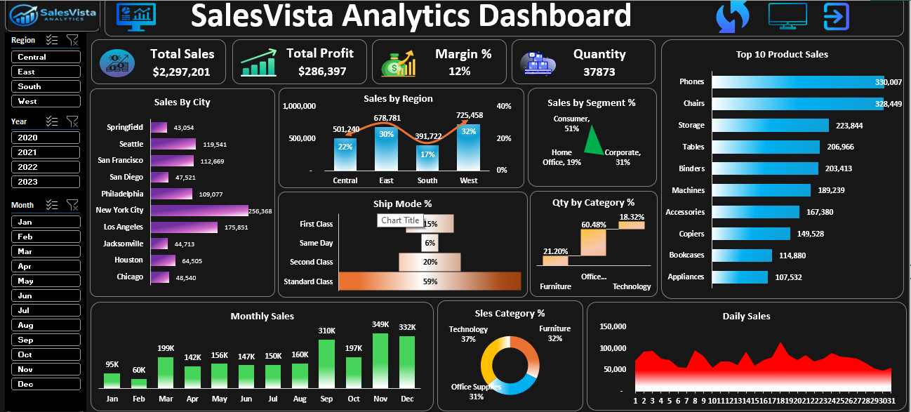

📊 SalesVista Analytics Dashboard

Overview

SalesVista Analytics Dashboard is an interactive Excel-based Business Intelligence solution designed to analyze sales performance, profitability, customer segments, product categories, and regional trends.

The dashboard provides actionable insights through KPI tracking, dynamic filtering, visual analytics, and VBA-powered automation, helping users make data-driven business decisions.

Dashboard Preview

Project Objective

The objective of this project is to build an interactive and user-friendly sales analytics dashboard that enables stakeholders to monitor key business metrics, identify trends, and evaluate sales performance across multiple dimensions.

Key Performance Indicators (KPIs)

Total Sales
Total Profit
Profit Margin %
Quantity Sold

Dashboard Features

Interactive Filtering

Region Filter
Year Filter
Month Filter

Visual Analytics

Sales by Region
Sales by City
Sales by Segment
Quantity by Category
Product Category Distribution
Monthly Sales Trend
Daily Sales Trend
Ship Mode Analysis
Top 10 Product Sales

VBA Automation

Refresh Dashboard Button
Dashboard Navigation Button
Presentation View Dashboard

Tools & Technologies Used

Microsoft Excel
Pivot Tables
Pivot Charts
Slicers
VBA Macros
Conditional Formatting
Data Visualization

Business Insights

This dashboard helps users:

Monitor overall sales and profitability.
Compare sales performance across regions and cities.
Analyze customer segments and purchasing behavior.
Track monthly and daily sales trends.
Identify top-performing products.
Evaluate product category performance.
Analyze shipping mode distribution.

Project Structure

SalesVista-Analytics-Dashboard

├── README.md

├── SalesVista Analytics Dashboard.xlsm

└── dashboard-preview.png

How to Use

1. Download the Excel dashboard file.
2. Open the workbook in Microsoft Excel.
3. Click Enable Content if prompted.
4. Use slicers to filter data dynamically.
5. Click the Refresh button to update dashboard visuals.
6. Explore KPIs and charts for business insights.

Skills Demonstrated

Data Analysis
Business Intelligence
Dashboard Development
Excel Automation
Data Visualization
KPI Reporting
VBA Programming

Author

Shradha Singh

MCA Graduate | Data Analytics Enthusiast | Excel Dashboard Developer

Connect With Me

LinkedIn: https://www.linkedin.com/in/shradha-singh-42416222a
GitHub: https://github.com/Shradha-08

